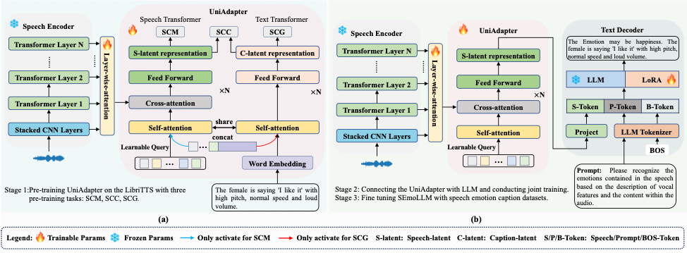
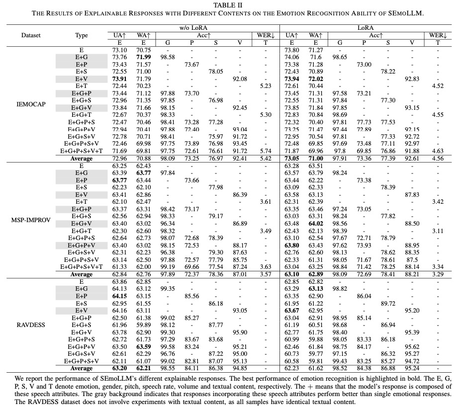
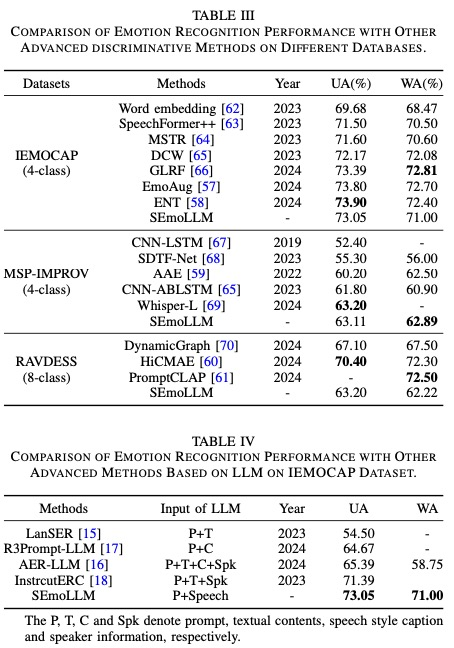

# Exploring the Use of Large Language Models and Interpretable Features for Explainable Speech Emotion Recognition

> [Qifei Li](), [Yingming Gao](), [Yuhua Wen](), [Yingying Zhou](), [Zhen Lian](), [Bin Liu](), [Zhenqi Wen](), [Jianhua Tao]() and [Ya Li]()<br>
> School of Aritificial Intelligence, Beijing University of Posts and Telecommunications & The National Laboratory of Pattern Recognition, Institute of Automation, Chinese Academy of Sciences & The Beijing National Research Center for Information Science and Technology, Tsinghua University & The Department of Automation, Tsinghua University<br>

## 📰 News
**[2024.12.25]** update the part of codes. 

We have updated parts of the SEmoLLM code and the second-phase pre-trained model. Please note that the currently released model parameters do not directly support the Prompt functionality. However, you can fine-tune the model to build a Prompt-enabled speech emotion recognition system, allowing you to design customized Prompts to guide the language model's responses. Additionally, you can immediately explore the powerful capabilities of SEmoLLM in speech recognition and speech style captioning. You can download the pretrained model from the [URL](https://drive.google.com/file/d/1Py2kL3uLF57XtsTSbLkFRgI1D45XmixH/view?usp=share_link).

Please be aware that due to limited computational resources, we have set the maximum input duration for speech to 6 seconds during training. We appreciate your understanding.


## ✨ Overview



Abstract:
Speech emotion recognition (SER) has made significant advancements in recent years due to its critical role in human-computer interaction. However, current studies predominantly rely on discriminative recognition methods, which can classify emotions but fail to provide insights into the reasoning behind the classification. Recently, researchers have started using large language models (LLM) for explainable SER. Existing studies have two main approaches: one relies on manually annotated information as the basis for LLM to explain emotions, but this annotation is costly. The other approach converts speech information into text for input into the LLM, but due to the limited content in text descriptions, emotion-related information may be lost, reducing the performance of emotion recognition. To address these issues, we first propose an automated method for annotating explainable speech emotion datasets, which uses interpretable speech features instead of manually annotated subjective information as the basis for LLM to interpret emotions, effectively reducing annotation costs. Second, we propose an explainable SER method based on LLM, called SEmoLLM, which directly uses speech signals as input to the LLM, avoiding the issue of emotion-related information loss. Finally, we evaluate the proposed method on three emotion datasets. The experimental results demonstrate that the performance of generative emotion recognition is comparable to that of discriminative emotion recognition, while also enabling basic speech emotion explanation. Furthermore, the results also show that generating descriptions of gender, pitch, or volume can contribute to improving emotion recognition performance. The proposed method and findings provide a new perspective on the explainability research in emotion-related tasks.


## 🚀 Main Results
<p align="center">
   <br>
   The Results of Explainable Responses with Different Contents on the Emotion Recognition Ability of SEmoLLM.
</p>

<p align="center">
   <br>
   Compared with other advanced methods.
</p>


## 🔨 Installation

Main prerequisites:

* `Python`
* `PyTorch`
* `transformers`
* `scikit-learn, scipy, pandas, numpy`
* `accelerate`
* `soundfile`
* `librosa`

If some are missing, please refer to [requirements.yml](./requirements.yml) for more details.


<!-- ## ➡️ File Description

1. dataloader.py. The file includes the method for loading datasets.

2. model.py  All models in this filse.

3. train.py. The training approach for Foal-net.

4. optims.py. The schedulers are in this file. -->

## 📍 Data Preparation
1. if you want to explore the powerful capabilities of SEmoLLM in speech recognition and speech style captioning, you can prepare the data as follow:


    ```
    1272_128104_000003_000002	/home/samba/public/EmotionCaption/dev-clean/1272/1272_128104_000003_000002.wav
    1272_128104_000005_000009	/home/samba/public/EmotionCaption/dev-clean/1272/1272_128104_000005_000009.wav
    1272_128104_000006_000003	/home/samba/public/EmotionCaption/dev-clean/1272/1272_128104_000006_000003.wav
    ```

    Moreover, the sample rate of these audio clips should be 16kHz. Then, you can conduct the command.

    ```
    python ./src/inference.py --test_src ./test.scp --wavlm_path ./wavlm-large --bert_path ./bert-case-uncased --llm_path ./Llama-2-7b-chat-hf --ckpt_path ./43.pth

    ```


## ☎️ Contact 

If you have any questions, please feel free to reach me out at `liqifei@bupt.edu.cn`.

## 👍 Acknowledgements

Thanks for the efforts of all the authors.

